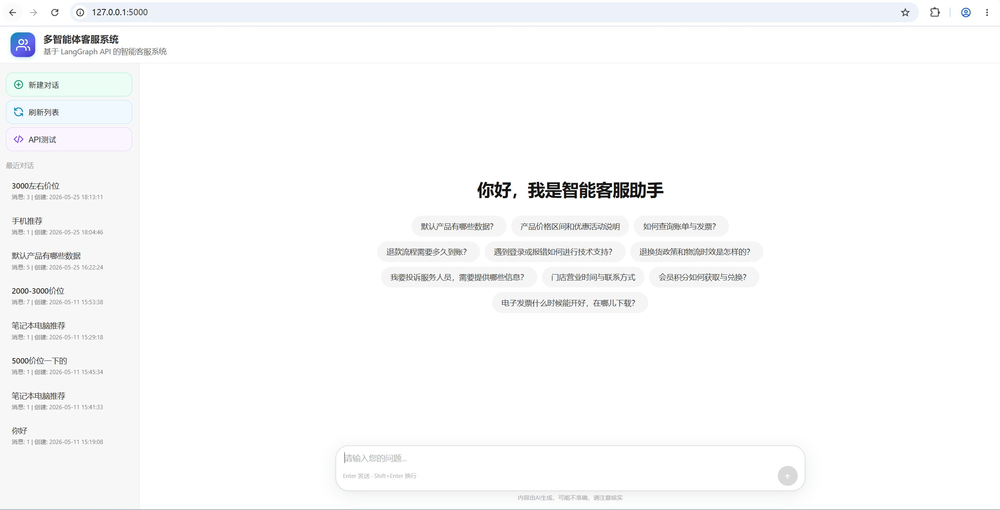
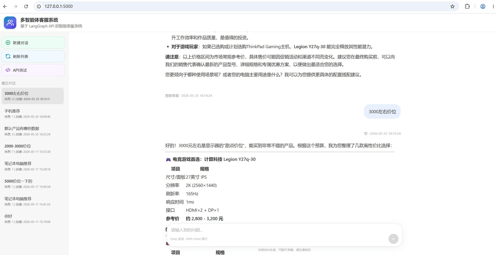
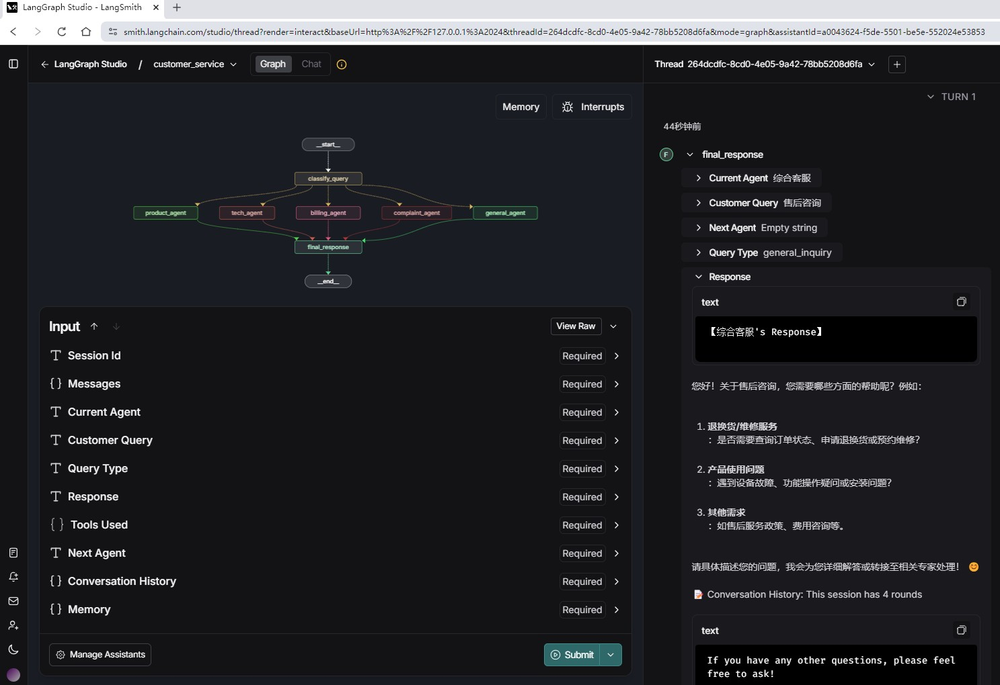

<h1 align="center">多智能体客服系统</h1>

<p align="center">
  <a href="LICENSE"></a>
  <a href="https://www.python.org/"></a>
  <a href="https://flask.palletsprojects.com/"></a>
  <a href="https://python.langchain.com/"></a>
  <a href="https://github.com/langchain-ai/langgraph"></a>
</p>

<p align="center"><em>模块化多智能体路由 · Flask Web 前台 · LangGraph 会话编排</em></p>


## 项目概述

这是一个基于LangGraph构建的多智能体客服系统，支持产品咨询、技术支持、账单处理、投诉处理等多种业务场景。系统采用模块化设计，每个智能体独立运行，通过配置文件定义工作流程。

## 运行效果

### 首页


### 多轮对话


### 工作流


## 项目结构

```
customer-service-ai-agent/
├── multi_agents/ # 智能体模块
│ ├── __init__.py # 智能体包初始化
│ ├── base_agent.py # 基础智能体类
│ ├── product_agent.py # 产品专家智能体
│ ├── tech_agent.py # 技术支持专家智能体
│ ├── billing_agent.py # 账单专家智能体
│ ├── complaint_agent.py # 投诉处理专家智能体
│ └── general_agent.py # 综合客服智能体
├── tools/ # 工具函数模块
│ ├── __init__.py # 工具包初始化
│ └── query_tools.py # 查询分类工具
├── templates/ # Web界面模板
│ └── index.html # 主页面HTML模板
├── config.py # 基础配置文件
├── multi_agent_customer_service.py # 主程序文件（LangGraph工作流）
├── session_manager.py # 会话管理器（LangChain标准接口）
├── web_app.py # Web 入口（Flask 路由与 HTTP 会话）
├── chat_web_service.py # LangGraph 调用、会话状态解析等业务逻辑
├── langgraph.json # LangGraph工作流配置
├── requirements.txt # 项目依赖
├── .env # 环境变量配置
├── README.md # 项目说明文档
└── README_LangGraph_CLI.md # LangGraph CLI使用说明
```

## 主要特性

### 1. 模块化智能体设计
- 每个智能体独立实现，职责单一
- 基于抽象基类，便于扩展和维护
- 支持动态LLM注入

### 2. 配置驱动的工作流
- 工作流定义在`langgraph.json`中
- 支持条件路由和直接连接
- 无需硬编码流程逻辑

### 3. 专业的业务领域
- **产品专家**: 产品信息咨询和推荐
- **技术支持专家**: 技术问题诊断和解决
- **账单专家**: 财务和账单问题处理
- **投诉处理专家**: 客户投诉和建议处理
- **综合客服**: 一般咨询处理

### 4. 智能对话上下文管理
- **会话管理**: 支持多会话并发，每个会话独立管理
- **历史对话缓存**: 完整的对话历史记录，包含时间戳和角色标识
- **上下文感知**: 智能体基于历史对话生成连贯、个性化的回答
- **记忆功能**: 集成LangChain记忆组件，支持长期对话记忆
- **多轮对话**: 同一会话内支持连续对话，避免重复信息

## 安装和配置

### 1. 安装依赖
```bash
pip install -r requirements.txt
pip install langgraph-cli
pip install -U "langgraph-cli[inmem]"
```
在win环境中，langgraph-cli下载后，需要将`langgraph.exe`路径加入PATH环境变量。或者使用时直接带全路径，例`<your site-packages>\bin\langgraph.exe`

### 2. 环境变量配置
复制 `env_example.txt` 为 `.env` 文件并配置。

### 3. 图结构自检
```bash
python multi_agent_customer_service.py
```

## 🚀 运行说明

### 方式1：使用Studio UI访问langgraph服务
```
langgraph dev
```
启动后，会自动拉起LangSmith服务，包含LangStudio UI，默认2024端口。使用浏览器访问`https://smith.langchain.com/studio/thread?render=interact&baseUrl=http://127.0.0.1:2024`

### 方式2：使用Web服务调用langgraph api
```
## 终端1：启动LangGraph服务
langgraph dev

## 终端2：启动自定义Web服务
python ./web_app.py
```
使用浏览器访问`http://localhost:5000`，界面功能：
- 实时聊天: 输入问题，获得智能回复
- 智能体信息: 显示当前处理问题的专家和查询类型
- 历史管理: 查看、清除对话历史
- 数据导出: 导出对话记录用于分析

### 方式3：直接API调用
接口文档访问地址默认`http://127.0.0.1:2024/docs`，内嵌了js需要挂梯子。也可参考`https://langchain-ai.github.io/langgraph/cloud/reference/api/api_ref.html`

需要`langgraph dev`启动LangGraph服务。

## 工作流程

1. **会话创建**: 为每个客户创建唯一会话ID
2. **查询分类**: 系统自动分析客户查询类型
3. **上下文加载**: 加载历史对话上下文
4. **智能体路由**: 根据查询类型路由到相应的专业智能体
5. **专业处理**: 专业智能体基于上下文处理客户查询
6. **响应生成**: 生成最终响应并更新会话历史
7. **状态保存**: 保存对话状态和记忆信息

### 工作流程图
```
客户查询 → 会话管理 → 查询分类 → 上下文加载 → 智能体路由 → 专业处理 → 最终响应
    ↓         ↓         ↓         ↓          ↓          ↓         ↓
  输入    会话创建   类型识别   历史加载    专家选择    专业解答    格式化输出
                ↓
            状态保存
```

### 状态管理
系统使用 `AgentState` 来管理整个工作流的状态：
- `customer_query`: 客户查询内容
- `query_type`: 查询类型分类
- `current_agent`: 当前处理智能体
- `response`: 智能体回复
- `tools_used`: 使用的工具列表
- `session_id`: 会话唯一标识
- `conversation_history`: 对话历史记录
- `memory`: LangChain记忆组件

## 关于硅基流动API
系统中llm大模型使用的是硅基流动模型服务商，也可选其他，都是使用统一的openAI接口规范。

### 优势特点
- **国内服务**: 访问速度快，延迟低
- **价格实惠**: 相比其他API服务更经济
- **模型丰富**: 支持多种开源模型
- **API兼容**: 完全兼容OpenAI API格式
- **配置简单**: 只需设置API密钥和模型名称

### 推荐模型
- `qwen2.5-7b-instruct` - 性价比高，适合一般应用
- `qwen2.5-14b-instruct` - 性能更好，适合复杂任务
- `llama3.1-8b-instruct` - 通用性强，稳定性好
- `mistral-7b-instruct` - 推理能力强

## 扩展指南

### 添加新的智能体

1. 在 `multi_agents/` 目录下创建新的智能体文件
2. 继承`BaseAgent`类并实现`process`方法
3. 在`multi_agents/__init__.py`中导入新智能体
4. 在`langgraph.json`中添加节点和边配置

### 添加新的工具函数

1. 在`tools/`目录下创建新的工具文件
2. 使用`@tool`装饰器定义工具
3. 在`tools/__init__.py`中导入新工具

### 修改工作流程

1. 编辑`langgraph.json`文件
2. 修改节点、边和路由配置
3. 重启系统应用新配置

## 技术架构

- **LangGraph**: 工作流编排框架
- **LangChain Core**: LLM集成和消息处理
- **硅基流动API**: 大语言模型服务
- **模块化设计**: 高内聚、低耦合的架构

## 相关文档
- [README_LangGraph_CLI.md](README_LangGraph_CLI.md) - LangGraph CLI使用指南
- [langgraph.json](langgraph.json) - 工作流配置文件
- [LangGraph API服务搭建](https://docs.langchain.com/langgraph-platform/cli#configuration-file)
- [LangGraph MCP适配器](https://github.com/langchain-ai/langchain-mcp-adapters)
